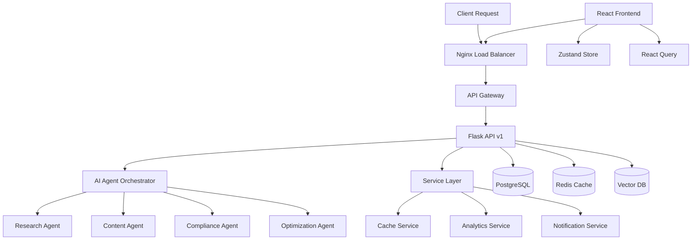

# Kuwait Social AI - Architecture Audit Report 🔍

## Executive Summary

While we've successfully implemented AI features and F&B specialization, our architecture has several critical gaps that could impact scalability, security, and maintainability as we grow.

**Overall Grade: B-** (Good functionality, needs structural improvements)

---

## 🔴 Critical Issues (Must Fix)

### 1. **No Agent Framework** - We're Using Level 1 AI, Not Level 2
**Current State:**
```python
# What we have - Simple AI calls
def generate_content(prompt):
    response = openai.chat.completions.create(...)
    return response
```

**What We Need:**
```python
# Agent-based architecture for complex workflows
from crewai import Agent, Task, Crew

class ContentModerationCrew:
    def __init__(self):
        self.cultural_agent = Agent(
            role='Kuwait Cultural Compliance Expert',
            goal='Ensure content respects local values',
            backstory='Expert in GCC cultural sensitivities'
        )
        
        self.halal_agent = Agent(
            role='Halal Compliance Checker',
            goal='Verify all F&B content is halal-appropriate'
        )
        
        self.trending_agent = Agent(
            role='Trend Analyzer',
            goal='Identify and leverage Kuwait food trends'
        )
```

### 2. **Security Vulnerabilities**
**Missing Security Headers:**
```nginx
# We need these in nginx.conf
add_header X-Frame-Options "SAMEORIGIN";
add_header X-Content-Type-Options "nosniff";
add_header X-XSS-Protection "1; mode=block";
add_header Strict-Transport-Security "max-age=31536000; includeSubDomains";
add_header Content-Security-Policy "default-src 'self'";
```

**No Rate Limiting Per Client:**
```python
# Current: Global rate limiting
# Needed: Per-client limits
from flask_limiter import Limiter

def get_client_id():
    # Rate limit by client account, not IP
    return get_jwt_identity()

limiter = Limiter(
    key_func=get_client_id,
    default_limits=["1000 per day", "100 per hour"]
)

# Premium clients get higher limits
@limiter.limit("5000 per day", key_func=get_premium_client_id)
```

### 3. **No Proper Testing Structure**
```python
# We need comprehensive tests
tests/
├── unit/
│   ├── test_ai_service.py
│   ├── test_f&b_templates.py
│   └── test_prayer_scheduler.py
├── integration/
│   ├── test_content_generation_flow.py
│   └── test_competitor_analysis.py
└── e2e/
    └── test_full_post_creation.py
```

### 4. **Poor Configuration Management**
```python
# Current: Scattered configs
# Needed: Centralized config with validation
from pydantic import BaseSettings

class Settings(BaseSettings):
    # API Keys
    openai_api_key: str
    anthropic_api_key: str
    
    # Kuwait Specific
    prayer_api_url: str
    weather_api_key: str
    
    # F&B Features
    default_halal_disclaimer: str = "100% Halal Certified"
    delivery_platforms: List[str] = ["Talabat", "Deliveroo"]
    
    class Config:
        env_file = ".env"
        env_file_encoding = "utf-8"
```

---

## 🟡 Major Improvements Needed

### 1. **Frontend Architecture Issues**

**Current Structure:** Flat and unorganized
```
src/
├── components/  # Everything dumped here
├── App.js
└── index.js
```

**Needed: Atomic Design**
```
src/
├── components/
│   ├── atoms/
│   │   ├── Button/
│   │   ├── Input/
│   │   └── Badge/
│   ├── molecules/
│   │   ├── PostCard/
│   │   ├── TemplateSelector/
│   │   └── PrayerTimeWidget/
│   ├── organisms/
│   │   ├── ContentGenerator/
│   │   ├── CompetitorDashboard/
│   │   └── F&BTemplateGallery/
│   └── templates/
│       ├── ClientLayout/
│       └── AdminLayout/
├── features/           # Feature-based organization
│   ├── ai-content/
│   ├── analytics/
│   └── f&b-tools/
└── pages/
```

### 2. **No State Management Strategy**
```typescript
// We need Zustand for global state
import create from 'zustand'

interface AIContentStore {
  templates: Template[]
  currentDraft: ContentDraft
  generationHistory: GeneratedContent[]
  
  generateContent: (params: GenerateParams) => Promise<void>
  saveTemplate: (template: Template) => void
  clearDraft: () => void
}

const useAIContentStore = create<AIContentStore>((set) => ({
  // State and actions
}))
```

### 3. **API Design Flaws**

**Current:** No versioning
```
/api/ai/generate
/api/content/create
```

**Needed:** Versioned APIs
```
/api/v1/ai/generate
/api/v1/content/create
/api/v2/ai/generate  # When we update
```

### 4. **Docker Compose Issues**
```yaml
# Current: Missing health checks and proper networking
# Needed:
services:
  backend:
    healthcheck:
      test: ["CMD", "curl", "-f", "http://localhost:5000/health"]
      interval: 30s
      timeout: 10s
      retries: 3
    deploy:
      resources:
        limits:
          cpus: '0.5'
          memory: 512M
```

---

## 🟢 What We Did Right

### 1. **Dependency Injection Pattern** ✅
Our refactoring to use service container was excellent:
```python
# Good pattern we implemented
def get_ai_service():
    global _ai_service
    if _ai_service is None:
        _ai_service = AIService()
    return _ai_service
```

### 2. **F&B Specialization** ✅
Deep domain knowledge implementation:
```python
# Excellent F&B focus
self.kuwait_context = {
    'food_hashtags': ['#KuwaitFood', '#Q8Food'],
    'cultural_requirements': ['HALAL', 'family-friendly'],
    'local_platforms': ['Talabat', 'Deliveroo']
}
```

### 3. **Comprehensive Error Handling** ✅
```python
# Good error hierarchy
class KuwaitSocialAIException(Exception):
    pass

class ContentGenerationException(KuwaitSocialAIException):
    pass

class TranslationException(KuwaitSocialAIException):
    pass
```

---

## 🚀 Immediate Action Plan

### Week 1: Security & Testing
1. **Add Security Headers** to nginx
2. **Implement Per-Client Rate Limiting**
3. **Create Test Structure** with pytest
4. **Add API Versioning**

### Week 2: Agent Architecture
1. **Integrate CrewAI** for multi-agent workflows
2. **Create F&B Specialist Agents**:
   - Menu Analysis Agent
   - Cultural Compliance Agent
   - Trend Spotting Agent
   - Competitor Analysis Agent

### Week 3: Frontend Refactor
1. **Implement Atomic Design**
2. **Add Zustand State Management**
3. **Integrate React Query**
4. **Create Component Library**

### Week 4: Infrastructure
1. **Add Health Checks** to all services
2. **Implement Proper Logging** with correlation IDs
3. **Set up Monitoring** (Prometheus + Grafana)
4. **Create CI/CD Pipeline**

---

## 📊 Technical Debt Score

| Area | Current | Target | Priority |
|------|---------|--------|----------|
| Backend Architecture | 7/10 | 9/10 | HIGH |
| AI Implementation | 5/10 | 9/10 | CRITICAL |
| Frontend Structure | 4/10 | 8/10 | HIGH |
| Security | 5/10 | 9/10 | CRITICAL |
| Testing | 2/10 | 8/10 | HIGH |
| DevOps | 4/10 | 8/10 | MEDIUM |

**Total Technical Debt: 45%** (Needs significant improvement)

---

## 🎯 Next Steps Priority

### 1. **Implement Agent Framework** (CRITICAL)
```python
# services/ai_agents/content_crew.py
from crewai import Agent, Task, Crew

class F&BContentCrew:
    """Multi-agent system for F&B content generation"""
    
    def __init__(self):
        self.research_agent = Agent(
            role='Kuwait Market Researcher',
            goal='Find trending topics and competitor insights'
        )
        
        self.content_agent = Agent(
            role='F&B Content Creator',
            goal='Create engaging, culturally appropriate content'
        )
        
        self.compliance_agent = Agent(
            role='Cultural Compliance Officer',
            goal='Ensure all content meets Kuwait standards'
        )
        
    def generate_campaign(self, restaurant_info, campaign_goal):
        # Multi-agent collaboration
        research = Task(self.research_agent, "Research trends")
        content = Task(self.content_agent, "Create content")
        review = Task(self.compliance_agent, "Review content")
        
        crew = Crew([research, content, review])
        return crew.kickoff()
```

### 2. **Fix Security Vulnerabilities** (CRITICAL)
- Implement all security headers
- Add input validation middleware
- Implement proper JWT refresh tokens
- Add request signing for critical operations

### 3. **Restructure Frontend** (HIGH)
- Migrate to atomic design
- Implement proper state management
- Add comprehensive TypeScript types
- Create reusable component library

---

## 💡 Architectural Vision



---

## 🏆 Conclusion

While Kuwait Social AI has strong domain features and AI integration, it needs architectural improvements to scale. The shift from simple AI calls to an agent-based architecture will be transformative, enabling complex workflows that truly differentiate the platform.

**Recommended Next Action:** Start with the agent framework implementation - it will unlock the most value and differentiate Kuwait Social AI from competitors.